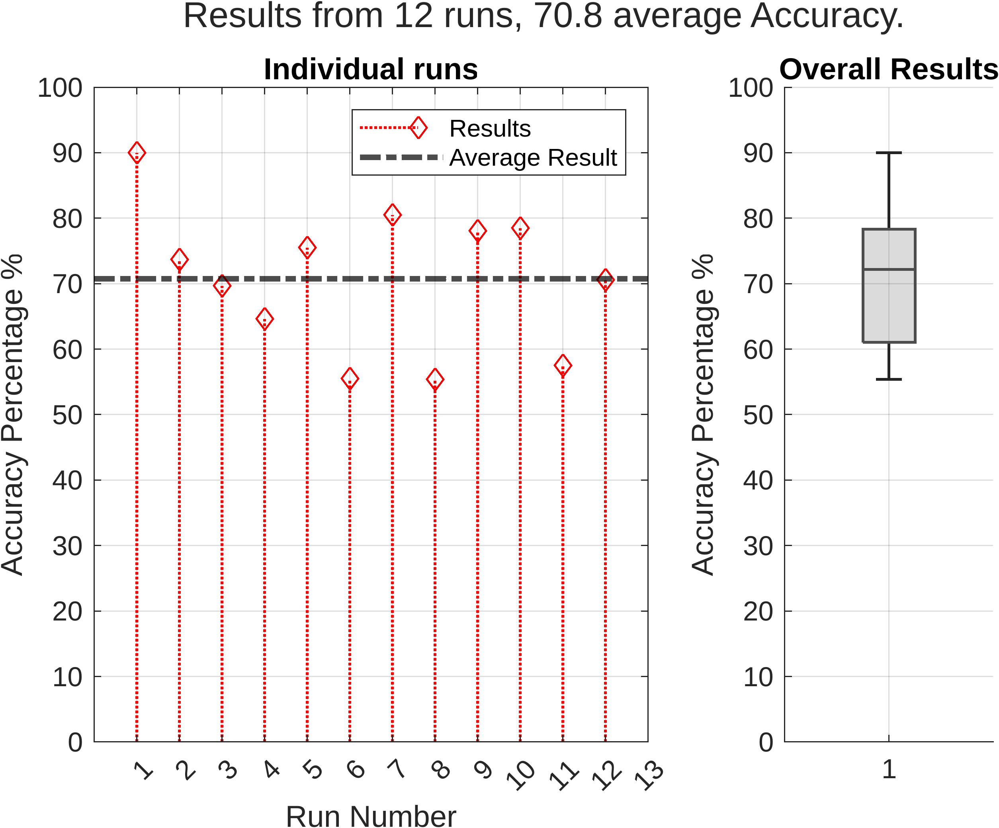
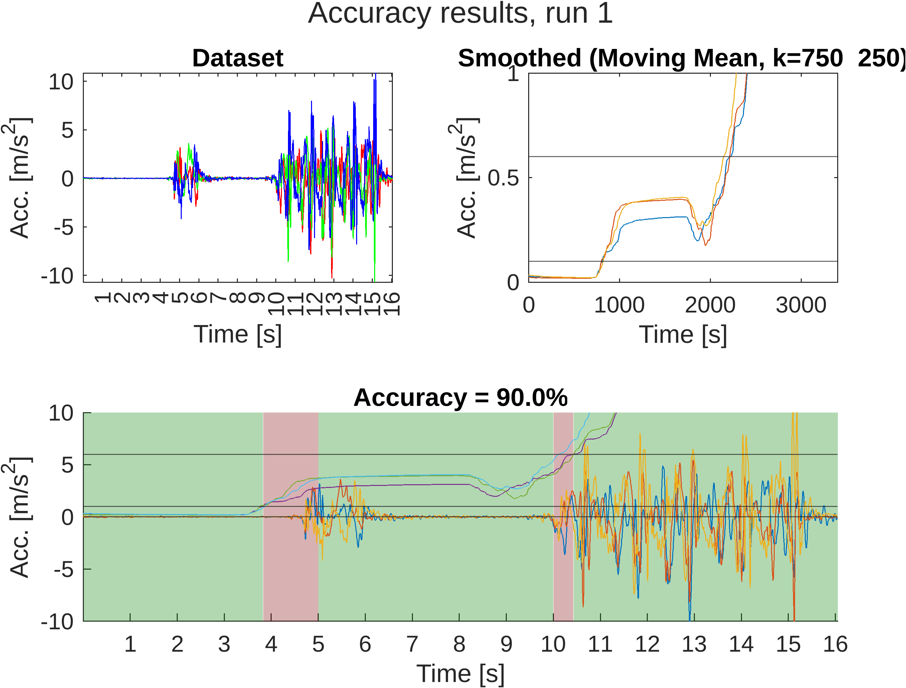

# ActivityLogger
MATLAB Activity Logger using acceleration data collected with android phones running phyphox.

Will use x,y,z acceleration data to determine if the user was sitting, standing, or walking during 
phases of the experiment. Outputs PNG files into the graphics folder (prefixed with the run name).

Includes the option to label the data, thus providing a accuracy score. CURRENTLY LABELS ARE REQUIRED,
PROGRAM WILL CRASH WITHOUT

Provides CLI UI to interact when the .mlx is run, and instructions to use the exp1.csv test dataset
are in the repo.

# Performance
Under semi-ideal conditions (12 datasets, collected by 4 people), the software was able to correctly predict
the state the user was in %70.8 of the time.

# Technical Report
This project was built for the "Problem Solving for Engineers" class at VU in Mebourne, in collaboration with
Derek Sakyi, Lochlan Hindle, and Jack Leamer-Alessi

Technical report can be found here: 
https://drive.google.com/file/d/1R1oWQ3Usrahl2oFbQY41FjZF5oWw8VR_/view?usp=drive_link
